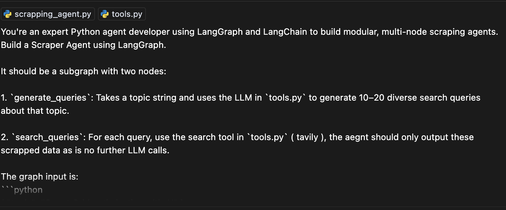
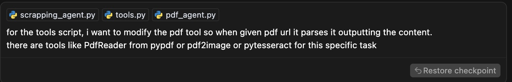
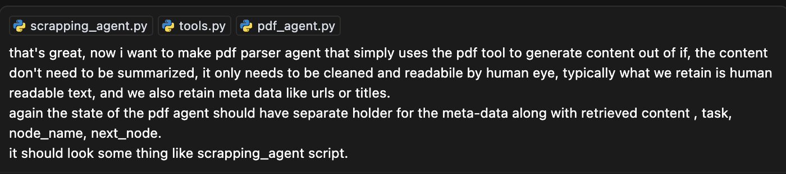
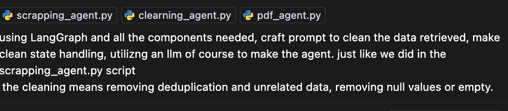
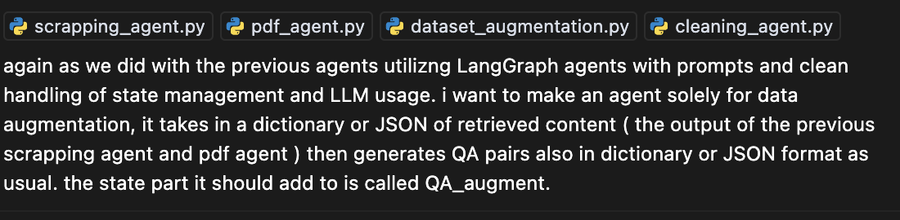

Agentic AI & MLOps Workflow for **EnergyAI**: Automating the Entire AI Lifecycle with Intelligent Agents

This project redefines MLOps by replacing traditional rigid pipelines with modular, intelligent agents.
Each core task—scraping, cleaning, augmentation, benchmarking, training, and evaluation—is handled by purpose-built agents.
Agents are not static; they include internal subgraphs, enabling multi-step reasoning and adaptive behaviors.
From messy raw data to a clean, fine-tuned model served via vLLM, the system handles the full AI lifecycle end-to-end.
The data pipeline builds a high-quality QA dataset through a chain of agents, intelligently ordered for optimal results.
Training uses configurable fine-tuning logic powered by OpenAI schema formatting and customizable SFT parameters.
Evaluation runs monthly via GitHub Actions, comparing candidate models against a benchmark QA set.
All logic is wrapped in Docker and served as REST APIs for production deployment.
This is not a prototype—it's a full-stack agentic system for scalable, self-improving AI pipelines.
Welcome to the future of intelligent AI/MLOps.

🧠 Prompt Engineering Showcase
Each agent in this system was designed using targeted prompt engineering strategies that emphasize clarity, modularity, and safe LLM usage. Below are five key prompts used to generate major components of the system:
___

___
Role specification: Framing the model as an expert Python agent developer sets a high expectation for output quality and modularity.
Agent modularity: The design is declarative, encouraging the model to follow LangGraph’s subgraph architecture cleanly.
Tool-based restriction: Clearly separates LLM work (query generation) from deterministic tool execution (search), avoiding hallucination and making the agent robust.
Realistic integration: Mentions existing tools.py, reinforcing reusability and grounding the response in your real codebase.
___

___
Clear goal: A very focused prompt with an unambiguous expected outcome.
Informed suggestions: Mentions specific libraries, guiding the model toward practical, executable solutions rather than abstract ideas.
Extensible: Opens the door for multi-modal parsing (images + text) via tools like pytesseract, demonstrating forward-thinking.
___

___
Consistent design: Promotes reuse of a successful pattern (scraping_agent), reducing architectural drift across agents.
Clean separation of concerns: Explicitly differentiates between content and metadata in state management—an excellent practice for downstream processing.
Minimal LLM dependence: Emphasizes extracting and cleaning rather than summarizing, keeping LLM calls efficient and controlled.
___

___
High-level goal, grounded execution: Clearly communicates intent (data cleaning), while grounding implementation in stateful LangGraph patterns.
Selective LLM usage: Reinforces the need for LLM only where needed—ideal for avoiding overuse or waste of tokens.
Pipeline alignment: Ensures that the cleaned data is agent-compatible for the next stage, showing awareness of the full system.
___

___
Strong chaining logic: Perfect example of multi-agent composition, as this agent depends on structured output from previous ones.
Output format control: The prompt ensures output is JSON/dict, critical for downstream automation and evaluation.
Clarity in state update: Maintaining QA_augment state reinforces reproducibility and structure across the entire pipeline.

🧠 How It All Works Together

This project is a modern Agentic AI + MLOps workflow designed with modularity, scalability, and automation at its core. Each task in the machine learning lifecycle — from data collection to evaluation and deployment — is powered by intelligent agents. Here's how the components interact:

⚙️ 1. Data Pipeline (Multi-Agent Architecture)
At the core of the project is a smart, chained data pipeline built from agents:

Scraper Agent → generates search queries and scrapes high-signal web content.
PDF Agent → parses domain-specific PDFs for additional data sources.
Cleaner Agent → aggressively removes irrelevant or duplicated content.
Augmentation Agent → generates QA pairs for training using the content itself.
Second Cleaner Agent → does a mild pass to polish the final dataset.
This intelligent pipeline ensures that the resulting dataset is domain-specific, high-quality, and automatically augmented with QA pairs — ideal for fine-tuning.

🏋️ 2. Training Pipeline
After data preparation:

training_pipeline.py uses the MainAgent to retrieve data, applies formatting_config.yaml to structure it into OpenAI-style format, and then launches fine-tuning using the settings in training_config.yaml.
This decouples data logic from model logic and ensures anyone can re-train by simply adjusting the YAMLs.

📊 3. Evaluation Pipeline
To track progress:

evaluation_pipeline.py builds a benchmark QA set using the same augmentation agents.
It compares the performance of two different models (baseline vs fine-tuned) using vLLM and provides a side-by-side report.
This allows quick validation of improvements without manual QA writing.

🚀 4. Deployment Pipeline
deployment_pipeline.py sets up a REST API layer for both the fine-tuned model and all agents, enabling programmatic use.
Docker files and Compose ensure local or cloud deployment is trivial and isolated.
🔁 5. CI/CD: Scheduled Automation
Using GitHub Actions (cron_pipeline.yaml), the system:

Runs the full data and training pipeline monthly,
Retrains the model using the latest web + PDF content,
And automatically deploys updates.
This transforms your pipeline into a self-sustaining AI factory.

🧱 Directory Structure (Key Parts)

energyAI/
├── config/                  # YAMLs for training, formatting, deployment
├── src/                    # the full source code and logic
├── pipelines/              # Data, training, evaluation, deployment logic
├── tools.py                # Shared helpers and utils
├── Dockerfile.*            # Container logic for agents and models
├── docker-compose.yml      # Unified deployment file
├── README.md               # (This file)
├── requirements.txt        # Python dependencies
📦 Features

✅ Modular multi-agent design for every ML task
✅ Automated QA augmentation and benchmark generation
✅ vLLM-based evaluation for real model comparison
✅ OpenAI-format training with config-first design
✅ Dockerized REST API serving (LLM + Agents)
✅ Scheduled GitHub Actions for monthly retraining
🚀 Get Started

# 1. Clone and install dependencies
pip install -r requirements.txt

# 2. Run pipelines
python pipelines/data_pipeline.py
python pipelines/training_pipeline.py
python pipelines/evaluation_pipeline.py

# 3. Deploy
docker-compose up --build